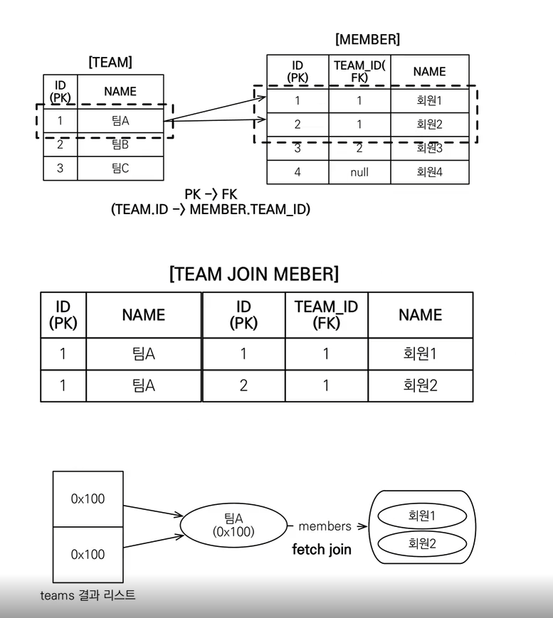
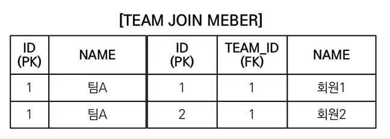
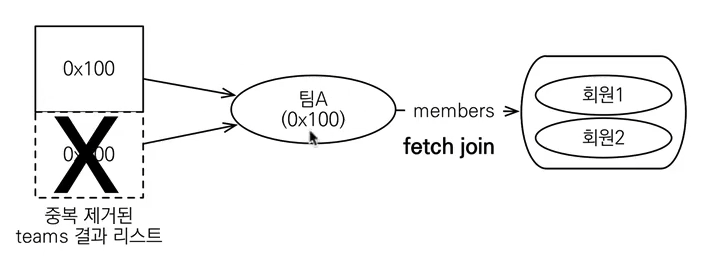
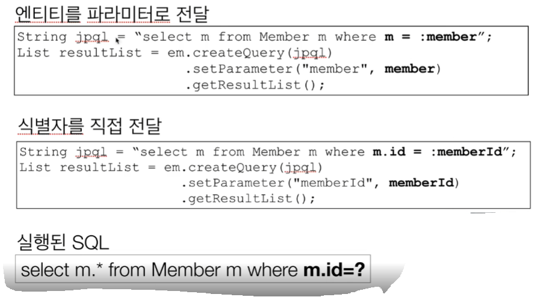

### 경로 표현식
- .(점)을 찍어 객체 그래프를 탐색하는 것
````java
select m.username -> 상태 필드
 from Member m
  join m.team t   -> 단일 값 연관 필드
  join m.orders o -> 컬렉션 값 연관 필드
where t.name = '팀A'
````
### 경로 표현식 용어 정리
- 상태 필드(state field): 단순히 값을 저장하기 위한 필드 (ex: m.username)
- 연관 필드(association field): 연관관계를 위한 필드
  - 단일 값 연관 필드:  
  @ManyToOne, @OneToOne, 대상이 엔티티(ex: m.team)
  - 컬렉션 값 연관 필드:  
  @OneToMany, @ManyToMany, 대상이 컬렉션(ex: m.orders)
### 경로 표현식 특징 (묵시적 조인 사용X)
- 상태 필드(state field): 경로 탐색의 끝, 탐색X
````java
"select m.username from Member m"
````
- 단일 값 연관 경로: 묵시적 내부 조인(inner join) 발생, 탐색O
  - 객체에서나 .을 이용해서 접근인데 DB 에서는 join 발생
  - "select m.team from Member m" 실행하면 join 발생
  - **조심해서 사용해야 된다!!!! 발생하면 안 됨!!!!!**
- **컬렉션 값 연관 경로**: 묵시적 내부 조인 발생, 탐색X
  - FROM 절에서 명시적 조인을 통해 별칭을 얻으면 별칭을 통해 탐색 가능 
  - "select m.username from Team t join t.members m"
### 상태 필드 경로 탐색
- JPQL: select m.username, m.age from Member m
- SQL: select m.username, m.age from Member m
### 단일 값 연관 경로 탐색
- JPQL: select o.member from Order o
- SQL:  
  select m.*  
  from Orders o  
  inner join Member m on o.member_id = m.id
### 명시적 조인, 묵시적 조인
- 명시적 조인: join 키워드 직접 사용
  - select m from Member m join m.team t
- 묵시적 조인: 경로 표현식에 의해 묵시적으로 SQL 조인 발생(내부 조인만 가능)
  - select m.team from Member m
### 경로 표현식 - 예제
- select o.member.team from Order o -> 성공 (**이렇게 사용X**)
- select t.members from Team -> 성공
- select t.members.username from Team t -> 실패
- select m.username from Team t join t.members m -> 성공
### 경로 탐색을 사용한 묵시적 조인 시 주의사항
- 항상 내부 조인
- 컬렉션은 경로 탐색의 끝, 명시적 조인을 통해 별칭을 얻어야 함
- 경로 탐색은 주로 SELECT, WHERE 절에서 사용하지만 묵시적 조인으로 인해 SQL의 FROM (JOIN) 절에 영향을 줌
### 실무 조언
- **가급적 묵시적 조인 대신에 명시적 조인 사용**
- 조인은 SQL 튜닝에 중요 포인트
- 묵시적 조인은 조인이 일어나는 상황을 한눈에 파악하기 어려움

<hr>

### 패치 조인(fetch join) => N + 1 문제 해결
- SQL 조인 종류X
- JPQL에서 **성능 최적화**를 위해 제공하는 기능
- 연관된 엔티티나 컬렉션을 **SQL 한 번에 함께 조회**하는 기능
- join fetch 명령어 사용
- 페치 조인 :: = [LEFT[OUTER] | INNER] JOIN FETCH 조인경로
### 엔티티 페치 조인
- 회원을 조회하면서 연관돤 팀도 함께 조회(SQL 한 번에)
- SQL을 보면 회원 뿐만 아니라 팀(T.*)도 함께 **SELECT**
- **[JPQL]**
  - select m from Member m **join fetch m.team**
- **[SQL]**
  - select M.**, T.* FROM MEMBER M  
  **INNER JOIN TEAM T** ON M.TEAM_ID = T.ID
````java
String query = "select m from Member m join fetch m.team";
List<Member> result = em.createQuery(query, Member.class)
        .getResultList();

for (Member member : result) {
    System.out.println("member = " + member.getUsername() + ", " + member.getTeam().getName());
}
지연 로딩이기 때문에 select 쿼리가 최소 2번이상 나가는 경우에서
fetch join을 이용한 한방 쿼리!
````
### 컬렉션 페치 조인
- 일대다 관계, 컬렉션 페치 조인
- **[JPQL]**
  - select t  
  from Team t **join fetch t.members**  
  where t.name = '팀A'
  - 
- **[SQL]**
  - SELECT T.**, M.*  
  FROM TEAM T  
  INNER JOIN MEMBER M ON T.ID = M.TEAM_ID  
  WHERE T.NAME = '팀A'
````java
String query = "select t from Team t join fetch t.members";
List<Team> result = em.createQuery(query, Team.class)
        .getResultList();

for (Team team : result) {
    System.out.println("team = " + team.getName() + " | members = " + team.getMembers().size());
        for(Member member : team.getMembers()) {
            System.out.println("member = " + member);
    }
}
팀A가 중복으로 출력 됨.
"일대다"에서는 데이터가 뻥튀기로 출력될 수 있음.
````
### 페치 조인과 DISTINCT
- SQL의 DISTINCT는 중복된 결과를 제거하는 명령
- JPQL의 DISTINCT 2가지 기능 제공
  - SQL에 DISTINCT를 추가
  - 애플리케이션에서 엔티티 중복 제거
- select **distinct** t  
from Team t join fetch t.members  
where t.name = '팀A'
- SQL에 DISTINCT를 추가하지만 데이터가 다르므로 SQL 결과에서 중복 제거 실패

- DISTINCT가 추가로 애플리케이션에서 중복 제거 시도
- 같은 식별자를 가진 **Team 엔티티** 제거  

[DISTINCT 추가시 결과]  
teamname = 팀A, team = Team@0x100  
-> username = 회원1, member = Member@0x200  
-> username = 회원2, member = Member@0x300
### 페치 조인과 일반 조인의 차이
- 일반 조인 실행시 연관된 엔티티를 함께 조회하지 않음
  - 즉 select를 필요할 때 마다 날린다는 뜻임
- **[JPQL]**  
select t  
from Team t join t.members m  
where t.name = '팀A'
- **[SQL]**  
SELECT T.*  
FROM TEAM T  
INNER JOIN MEMBER M ON T.ID = M.TEAM_ID  
WHERE T.NAME = '팀A'
- JPQL은 결과를 반환할 때 연관관계 고려X
- 단지 SELECT 절에 지정한 엔티티만 조회할 뿐
- 여기서는 팀 엔티티만 조회하고, 회원 엔티티는 조회X
- **페치 조인을 사용할 때만 연관된 엔티티도 함께 조회(즉시로딩)**
- **페치 조인은 객체 그래프를 SQL 한번에 조회하는 개념**
### 페치 조인 실행 예시
- 페치 조인은 연관된 엔티리를 함께 조회함
- **[JPQL]**  
select t  
from Team t join fetch t.members  
where t.name = '팀A'
- **[SQL]**  
SELECT T.**, M.*  
FROM TEAM T  
INNER JOIN MEMBER M ON T.ID = M.TEAM_ID  
WHERE T.NAME = '팀A'

### 페치 조인의 특징과 한계
- **페치 조인 대상에는 별칭을 줄 수 없다.**
  - 하이버네이트는 가능, 가급적 사용X
- **둘 이상의 컬렉션은 페치 조인 할 수 없다.**
- **컬렉션을 페치 조인하면 페이징 API를 사용할 수 없다.**
  - 일대일, 다대일 같은 단일 값 연관 필드들은 페치 조인해도 페이징 가능
  - 하이버네이트는 경고 로그를 남기고 메모리에서 페이징(매우 위험)
- 연관된 엔티티들은 SQL 한 번으로 조회 - 성능 최적화
- 엔티티에 직접 적용하는 글로벌 로딩 전략보다 우선함
  - @OneToMany(fetch = FetchType.LAZY) 글로벙 로딩 전략
- 실무에서 글로벌 로딩 전략은 모두 지연 로딩
- 최적화가 필요한 곳은 페치 조인 적용

### 페치 조인 - 정리
- 모든 것을 페치 조인으로 해결할 수 없음
- 페치 조인은 객체 그래프를 유지할 때 사용하면 효과적
- 여러 테이블을 조인해서 엔티티가 가진 모양이 아닌 전혀 다른 결과를 내야 하면, 
페치 조인 보다는 일반 조인을 사용하고 필요한 데이터들만 조회해서 DTO로 반환하는 것이 효과적

<hr>

### 다형성 쿼리 TYPE
- 조회 대상을 특정 자식으로 한정
- 예) Item 중에 Book, Movie를 조회해라
- **[JPQL]**  
select i from Item i  
where type(i) IN (Book, Movie)
- **[SQL]**  
select i from i  
where i.DTYPE in ('B', 'M')

### TREAT
- 자바의 타입 캐스팅과 유사
- 상속 구조에서 부모 타입을 특정 자식 타입으로 다룰 때 사용
- FROM, WHERE, SELECT(하이버네이트 지원) 사용
- 예) 부모인 Item과 자식 Book이 있다.
- **[JPQL]**  
select i from Item i  
where treat(i as Book).auther = 'kim'
- **[SQL]**  
select i.* from Item i  
where i.DTYPE = 'B' and i.auther = 'kim'

### 엔티티 직접 사용 - 기본 키 값
- JPQL에서 엔티티를 직접 사용하면 SQL에서 해당 엔티티의 기본 키 값을 사용
- **[JPQL]**  
select count(m.id) from Member m // 엔티티의 아이디를 사용  
select count(m) from Member m // 엔티티를 직접 사용
- **[SQL]**(JPQL 둘 다 같은 다음 SQL 실행)  
select count(m.id) as cnt from Member m

### 엔티티 직접 사용 - 외래 키 값
````java
String query = "select m from Member m where m.team = :team";
List<Member> findMember = em.createQuery(query, Member.class)
        .setParameter("team", teamA)
        .getResultList();

for (Member member : findMember) {
    System.out.println("member = " + member);
}
m.team.id = : teamId
"teamId", teamId
// 실행된 SQL
select m.* from Member m where m.team_id = ?
````

### Named 쿼리 - 정적 쿼리
- 미리 정의해서 이름을 부여해두고 사용하는 JPQL
- 정적 쿼리
- 어노테이션, XML에 정의
- 애플리케이션 로딩 시점에 초기화 후 재사용
- **애플리케이션 로딩 시점에 쿼리를 검증**

### Named 쿼리 - 어노테이션 (Spring Data JPA를 사용하자)

````java
@Entity
@NamedQuery(
        name = "Member.findByUsername",
        query = "select m from Member m where m.username = :username")
public class Member {}

List<Member> resultList =
    em.createNamedQuery("Member.findByUsername", Member.class)
            .setParameter("username", "회원1")
            .getResultList();
````

<hr>

### 벌크 연산
- 재고가 10개 미만인 모든 상품의 가격을 10% 상승하려면?
- JPA 변경 감지(dirty check) 기능으로 실행하려면 너무 많은 SQL 실행
  - 1. 재고가 10개 미만인 상품을 리스트로 조회한다.
  - 2. 상품 엔티티의 가격을 10% 증가한다.
  - 3. 트랜잭션 커밋 시점에 변경 감지가 동작한다.
- 변경된 데이터가 100건이라면 100번의 UPDATE SQL 실행

### 벌크 연산 예제
- 쿼리 한 번으로 여러 테이블 로우 변경(엔티티)
- **executeUpdate()의 결과는 영향받은 엔티티 수 반환**
- **UPDATE, DELETE 지원**
- **INSERT(insert into .. select, 하이버네이트 지원)**

### 벌크 연산 주의 (Spring Data JPA에서 더 공부하자)
- 벌크 연산은 영속성 컨텍스트를 무시하고 데이터베이스에 직접 쿼리
- 그럼 어떻게 해야 될까? (해결책)
  - 벌크 연산을 먼저 실행 
  - **벌크 연산 수행 후 영속성 컨텍스트 초기화**
````java
int resultCount = em.createQuery("update Member m set m.age = 20")
                    .executeUpdate();
System.out.println("resultCount = " + resultCount);

em.clear();

Member findMember = em.find(Member.class, member1.getId());
System.out.println("findMember.getAge() = " + findMember.getAge());

clear를 하지 않으면 영속성 컨텍스트에서 값을 들고오기 때문에 0출력
벌크 연산은 영속성 컨텍스트에 영향을 안 주고 바로 DB에 접근하기 때문이다.
그러므로 em.clear(); 가 꼭 필요하다!
````
